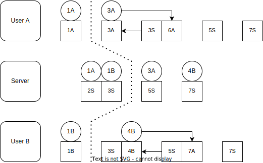
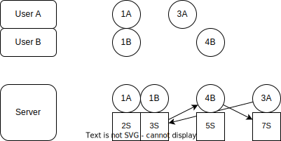

### Synchronisation
No idea, but I feel like it would be a good idea to document the synchronisation process here rather than coding it immediately.
### 1700 Understanding the problem


The circles represent the user inputs, and the squares represent the game states. Since this method relies on a rollback strategy, it is required that game states are immutable and it is okay to create new game states, but whatever optimisation can come later.

At t=1, user input `1A` and user input `1B` are made.

### 1710 Whatever this is too complicated.


(In the diagram the circle represents the user inputs and the squares represents the game state)

Just note that the server is the one that is doing the synchronisation. Hence, from the server POV, it is retrieving a stream of user inputs (from all the users), and has to synchronise the game states. If it receive a stream that is out of order, it rollbacks the state to where it is suitable and replay back the user inputs.

Then the client will just have to wait for the game states from the server and done.

I suppose that this is all fine and dandy right, like what can go wrong with this? As in with regards to the syncing process. The server is the synchroniser.

### 1715 Optimisation issue: User experiences lag between their user inputs and the rendered game.


To resolve this issue, it is "as simple as" asking the client to evaluate and render the game state first instead of waiting for server. Then when it receives from the server, it will then overwrite it's game state.

#
In the POV of the client, it is the opposite of the how the server sees.

Recall that the server sees gets a stream of user inputs and then transforms a stream of game states.

#
The client also does rollback and replay by its own. But it has to throw away its outdated game states thats all.

#
The server deals with out of order stream of user inputs, and does rollback on the game states, and replays the user inputs.

The client deals with new (out of order) stream of game inputs, and does rollback on the game states, and replays the user inputs.

### 1730 Time to implement stuff
Given that the user (as in the game devs) has implemented:
```
update :: state -> input -> state
```
The user also need a way to send the user inputs... Let's assume we have a stream of user inputs, `List Input`. But then each user input also have a timestamp provided by the client, so that will be `List (Time, Input)`. We need to transform this into a stream of game states using the `update` function provided. `List (Time, Input)` -> `List State`.

To recall:


Given the user inputs `[1A, 1B, 4B, 3A]`,
we need to transform it to `[2S, 3S, 5S, 7S]`.

Do you notice that for each iteration of state, what we are basically doing is finding a suitable game state to rollback to (ideally, no out of sync and it uses back the current one).

```
def stuff(inputs):
    inputs' = []
    states' = []
    for input in inputs:
        append input to inputs'
        sort inputs'

        state = find state that is just before input.time
        
        old_inputs = filter inputs that is after input
        replay_inputs = input : old_inputs

        new_state = foldr update replay_inputs state

        states'.append(new_state)
        yield new_state
        (yeah remember to add the oldest replay_inputs.time into new_state.time)
```

```


```